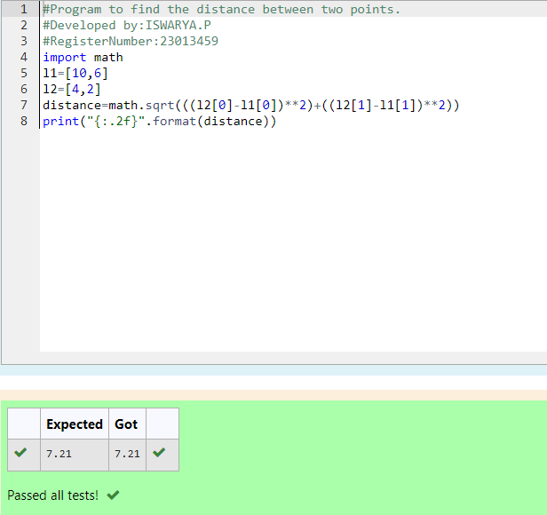

# DISTANCE-BETWEEN-TWO-POINTS

## AIM:
To write a python program to find the distance two 2 points
## ALGORITHM:

### Step 1: 
Get the two value from the user.
### Step 2: 
write the program for distance betweem two points.
### Step 3: 
Substitute the values in the distance formula  
### Step 4: 
print the values using distance forumula.
### Step 5: 
End the program.
### PROGRAM:
```
#Program to find the distance between two points.
#Developed by:ISWARYA.P
#RegisterNumber:23013459
import math
l1=[10,6]
l2=[4,2]
distance=math.sqrt(((l2[0]-l1[0])**2)+((l2[1]-l1[1])**2))
print("{:.2f}".format(distance))
```
  
  ### OUTPUT:
  

### RESULT:
Thus the distance between two points are executed successfully.

